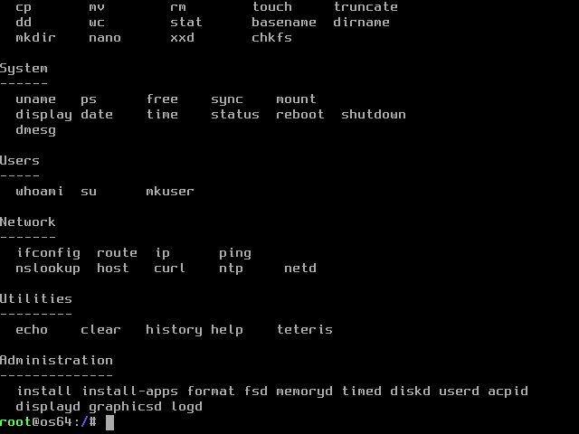
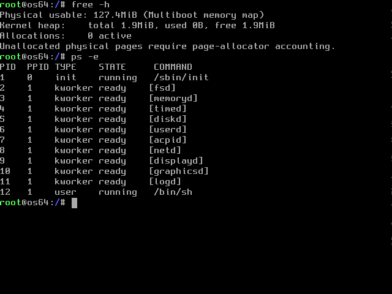
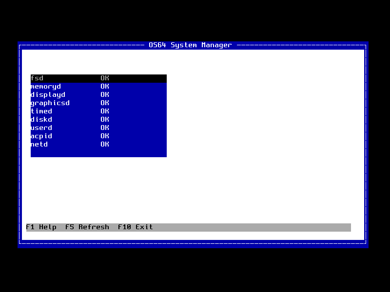

<div align="center">

```text
   ____  _____  __   _  _
  / __ \/ ___/ / /_ | || |
 | |  | \__ \ | '_ \| || |_
 | |__| |___/ /| (_) |__   _|
  \____/|____/  \___/   |_|
```

# OS64 1.0

**A lightweight experimental operating system for x86_64**

Kernel · Initramfs · Unix-style userland · Networking · Native SDK

</div>

---

OS64 is an educational 64-bit x86 operating system. GRUB loads a Multiboot2
bootstrap which verifies x86-64 long-mode support before entering the
freestanding kernel. The kernel provides VGA and serial consoles, PS/2 input,
ATA/FAT32 storage, a read-only USTAR initramfs, VFS dispatch, an ELF64
application ABI, users, protected password hashes, cooperative services, and a
PS/2-driven graphical desktop session.

## OS64 Running in QEMU

### Boot and login


### Command help



### Memory and background workers



### System Manager



Regenerate every image above from a real QEMU session with:

```sh
make generate-screenshots
```

## Source layout

- `boot/` contains GRUB configuration and boot/linker support.
- `kernel/arch/x86_64/` contains architecture bootstrap and interrupts.
- `kernel/drivers/` contains ACPI, disk, display, keyboard, and RTC drivers.
- `kernel/core/`, `kernel/fs/`, `kernel/mm/`, and `kernel/security/` contain
  their respective kernel subsystems.
- `kernel/include/os64/` contains private kernel headers.
- `user/bin/` and `user/sbin/` describe normal and administrative commands.
  Their ELF trampolines are built from `user/lib/builtin.c`.
- `user/games/teteris/` is the optional Teteris application source.
- `packages/packages.json` is the validated package catalog; matching native
  ELF sources live under `packages/apps/`.
- `rootfs/` is the human-maintained root filesystem template.
- `libc/` is reserved for the freestanding C library.
- `sdk/` contains the public application ABI, linker script, build rules, and
  examples.
- `scripts/` contains image and application-discovery tooling.
- `build/` contains generated artifacts only and may always be deleted.

No object or generated executable is written beside its source. Kernel objects
go to `build/obj/kernel`, user objects to `build/obj/user`, and applications are
installed directly into `build/rootfs`. The initramfs, ISO staging area, and
final images have distinct directories below `build/`.

## Root filesystem and storage

`rootfs/` is copied to `build/rootfs`, populated with compiled applications,
then packed as `build/initrd/initrd.tar`. GRUB loads this archive as a separate
Multiboot2 module alongside `kernel.bin`; it is not embedded recursively in the
kernel. The USTAR encoding is an implementation detail; the VFS exposes it as
the read-only `initramfs` root filesystem. It provides `/bin`, `/sbin`,
`/etc`, `/lib`, and `/usr`. Normal programs are installed in `/bin` or
`/usr/bin`; administrative programs are installed in `/sbin` or `/usr/sbin`.
Teteris is installed as `/usr/bin/teteris`, with game data reserved below
`/usr/share/games`.

At boot, the VFS exposes the USTAR initramfs and mounts `/dev/sda1` at `/home`
and `/dev/sda2` at `/var`. It also mounts generated `procfs` at `/proc`,
device-backed `devfs` at `/dev`, and a bounded volatile `tmpfs` at `/tmp`.
FAT32 is used for the interoperable home partition. The native partition can
be formatted as standard ext2, ext3, or ext4; installation defaults to ext4.
The compact kernel driver uses 4 KiB blocks, standard block and inode bitmaps,
128-byte inodes, directory records, direct blocks, modes, UID/GID, and link
counts. Ext3/ext4 volumes contain the standard internal JBD2 journal inode;
ext4 also advertises the standard extents incompatibility feature while OS64's
own small files remain valid legacy block-mapped inodes. Volumes produced by
OS64 can be inspected and checked with Linux `debugfs`, `blkid`, and `e2fsck`.
`/etc/passwd` holds public account metadata and protected `/etc/shadow`
holds salted PBKDF2-HMAC-SHA256 verifiers. Denied filesystem operations return
an error instead of crashing the kernel.

Run `make smoke-commands` to boot an isolated QEMU disk and invoke every
installed `/bin` and `/sbin` command. The matrix rejects hangs, crashes, and
nonzero exit statuses and automatically fails when a new command lacks a test.
It also downloads, installs, executes, inspects, and removes a package through
`pm`.

The attached disk is `build/images/os64-disk.img`. `format /dev/sda` creates
FAT32 plus default ext4 data filesystems; pass `ext2`, `ext3`, or `ext4` as the
second argument to select the native format. `install /dev/sda` performs a complete installation:
it formats the partitions, installs the GRUB BIOS boot area, and copies
`KERNEL.BIN` and `INITRD.BIN` to the FAT32 boot volume. The resulting disk boots
without the ISO. Shutdown and reboot synchronize and unmount writable
filesystems. `make check-fat` runs a read-only `fsck.fat` validation of the
FAT32 partition.

## Build and run

Required host tools include GCC/binutils with x86-64 support, NASM, GRUB image
tools, `xorriso`, QEMU, DOS/FAT utilities, and standard POSIX shell tools.

```sh
make                 # build ISO and persistent disk image
make check           # validate the Multiboot2 kernel
make check-fat       # validate the FAT32 home partition
make check-ext       # create and host-check ext2, ext3, and ext4 variants
make run             # serial terminal, no graphical display
make run-console     # QEMU nographic console
make run-gui         # VGA/PS2 graphical VM
make run-gui-native  # native QEMU window; no VNC or websockify
make run-pcnet       # test the AMD PCnet adapter used by VirtualBox
make run-installed   # boot an installed disk without the LiveCD
make debug           # QEMU stopped with a GDB server on port 1234
make clean           # safely delete the complete generated build/ tree
```

Final images are `build/images/os64.iso` and
`build/images/os64-disk.img`. GRUB provides normal, CLI, resolution, debug,
recovery, rescue, and **Desktop** entries. Use `Ctrl-a x` to exit
a nographic QEMU session.

The native application SDK supports freestanding C11 and C++17. C++ programs
get deterministic startup, global constructors/destructors, `new`/`delete`,
and the OS64 C++ convenience API without pulling in a hosted Linux runtime.
Build the reference program with `make -C sdk/examples/cpp`.

`/usr/bin/edit` is an initial native compatibility milestone toward porting
[Microsoft Edit](https://github.com/microsoft/edit). It provides full-screen
editing through the OS64 terminal and VFS APIs. The audited upstream revision,
current limitations, and work required for a source-complete Rust port are in
`ports/microsoft-edit/README.md`.

The live ISO uses the OS64 GRUB theme from `boot/grub/theme/theme.txt`. During
ISO staging, `scripts/generate-grub-theme.py` creates compact, ASCII-subsetted
OS64 Mono and OS64 Display PF2 faces from the open DejaVu fonts supplied by the
build toolchain, then generates the background and selection artwork. The result is a crisp
1024x768 boot menu with custom typography, restrained dark/green branding,
keyboard guidance, and a timeout indicator. Generated assets exist only in
`build/`; GRUB still falls back through its `auto` graphics mode.

GRUB passes an explicit `bootmode=` kernel argument. Supported values are
`bootmode=normal`, `bootmode=desktop`, `bootmode=cli`, `bootmode=debug`, and
`bootmode=recovery`. Desktop mode selects a 1024x768 framebuffer and starts the
kernel's pixel-rendered graphical shell after boot services are ready. It draws
a desktop, window, icons, taskbar, and clickable Start menu directly into the
framebuffer. Its graphical Terminal application uses the kernel TTY line
discipline for editable input and scrollback and executes commands through the
same shell dispatcher as the text console. Click Terminal in Applications or
the taskbar, or press `T` to open it. Desktop mode remains active until shutdown
or reboot; F10 does not terminate the graphical session. CLI
mode forces text output and refuses full-screen TUI applications. The older
`mode=` spelling remains accepted for compatibility. Debug mode enables
diagnostic command-line output; recovery mode skips writable storage, account,
and network startup. Additional independent arguments include
`console=serial`, `loglevel=debug`, and `single`.

Desktop composition and window policy are separate kernel subsystems. The
compositor owns framebuffer clipping, desktop/panel composition, window frames,
client regions, and text drawing. The window manager owns focus, hit testing,
stacking order, geometry, close/create operations, and tiled or floating
layouts. Up to six terminal windows can run with independent editable input and
scrollback. Use `F2` for a new terminal, `F3` to cycle focus, `F4` to close the
focused window, and `F5` to toggle master/stack tiling and floating mode.
Floating windows can be dragged by their title bars; tiled windows are arranged
automatically without overlap.

The first graphical release opens to an uncluttered floating desktop with
launchable Terminal, Files, Images, and
System desktop icons. Files and System open focused terminal clients with the
relevant command already executed; Images opens the native image-viewer applet.
The viewer accepts Netpbm PPM P3/P6 and uncompressed Windows BMP files with
24-bit or 32-bit pixels, validates dimensions and file bounds, and scales images
to the client area while preserving aspect ratio. From a graphical terminal use
`view PATH` or `viewer PATH`, for example:

```text
view /usr/share/images/os64.ppm
view /usr/share/images/os64.bmp
```

The PPM sample is source controlled, while the equivalent 24-bit BMP sample is
generated reproducibly during the build.

The bundled Mini64 rescue system has its own small recovery shell. In addition
to reinstalling OS64, it can inspect Multiboot memory and payload modules,
identify the primary ATA disk, dump raw sectors, validate/mount/unmount FAT32,
flush pending writes, inspect command history, select the next boot mode, and
reboot or halt. Run `help` inside Mini64 for the complete command list.
Its recovery tools now include `partitions`, `pstore`, `verify`, and guarded
sector replacement. `erase LBA [COUNT]` writes zeroes; adding `-r` requires
either `-h BYTE` or `-s STRING` as the repeating replacement pattern. It asks
for case-insensitive `erase` confirmation unless the explicitly unsafe `-no`
option is supplied.
Mini64 handles Shift and Caps Lock and accepts confirmation words without
requiring uppercase input. Recovery replacement frees the previous FAT chain
before writing `KERNEL.BIN` and `INITRD.BIN`, so repeated recovery runs do not
leak clusters or exhaust root-directory entries.

The live Mini64 environment also provides `install` and `install -no`. A normal
installation validates the kernel, initramfs, Mini64 image, boot-manager policy,
and bootloader payload, asks before repartitioning an uninitialized disk, writes
`KERNEL.BIN`, `INITRD.BIN`, `MINI64.BIN`, and `GRUB.CFG`, synchronizes the disk,
and verifies the installed directory entries. `-no` explicitly skips the
confirmation for automated recovery. Existing FAT installations are mounted
and updated rather than formatted again.

`BOOTLOADER` in `build.cfg` selects `grub` or `os64`. The `os64` option builds
the OS64 Boot Manager policy from `boot/os64/manager.cfg` on top of GRUB's
audited BIOS/FAT transport. It supports persistent `normal`, `desktop`, `cli`,
`debug`, and `recovery` modes selected with Mini64's `bootmode MODE` command. A
kernel panic writes a checksummed record to reserved raw-sector pstore and a
one-shot FAT boot flag. On the next installed-disk boot, the manager starts
Mini64 with the kernel and initramfs recovery modules; Mini64 consumes the flag
so later boots return to OS64. Use `pstore show` to inspect the surviving record
or `pstore clear` as root to erase it.

The input stack separates the experimental i8042/PS/2 controller transport from
keyboard scan-code decoding. It initializes the first controller port, resets
the keyboard, selects Set 2 with controller translation, enables scanning, and
falls back to serial input when probing fails. Desktop startup also probes the
second PS/2 port, enables three-byte mouse reporting, and renders a pixel cursor
while preserving the framebuffer below it. PS/2 readiness is visible to native
SDK applications through the system-query ABI.

## Applications

Generic command names are maintained in `user/commands.conf`. `make scan-apps`
searches application directories containing a Makefile and prints the
discovered projects; the user build installs each output into its canonical
root filesystem destination without a duplicate binary cache.

For a browser-accessible graphical console, run `make run-gui`. It starts QEMU
on VNC display `:0` (`localhost:5900`) and automatically starts websockify with
the noVNC files under `/usr/share/novnc`. Open
`http://localhost:6080/vnc.html`. In GitHub Codespaces, forward port 6080 and
open the forwarded address instead. Stopping QEMU also stops the managed
websockify process. The target reports a clear error if noVNC or websockify is
not installed.

For a local graphical session, run `make run-gui-native`. It opens OS64
directly in QEMU's GTK window with native keyboard and mouse input and does not
start VNC, noVNC, websockify, or a browser. Set `QEMU_NATIVE_DISPLAY=sdl` to use
QEMU's SDL frontend instead.

`pm` is OS64's small Internet package manager. It retrieves its catalog and
base64-transported x86_64 ELF payloads from the project on
`raw.githubusercontent.com` using OS64's certificate-validated HTTPS client.
Downloaded executables are validated and installed persistently in `/var/apps`;
their catalog SHA-256 digest is checked before installation, and they are not
embedded in the initramfs:

```sh
pm update
pm list
pm info hello
pm install essentials
pm install hello
hello OS64
pm remove hello
```

The catalog contains the essential `sysfetch` and `netcheck` tools, the `hello`
SDK example, and two genuine upstream ports: the MIT-licensed `c2048` game and
the ISC-licensed `sectorlisp` interpreter. Package installation and removal
require a root, administrator, or power-user account; listing and inspection
are available to every user. The live image retains only a human-readable
catalog copy at `/usr/share/os64/packages/packages.json`; it contains no
package executables.

```sh
pm install c2048
c2048
pm install sectorlisp
sectorlisp
```

Upstream attribution, porting notes, and license texts live beside each port in
`packages/apps/`. Neither port depends on POSIX syscalls or a hosted C runtime.

## HTTPS browser and hardware discovery

`browser URL` launches a keyboard-driven Lynx-style TUI reader with an editable
address bar, scrollable document pane, reload, status information, and help.
It accepts HTTP and HTTPS, defaults bare hostnames to HTTPS, follows up to five
redirects without allowing an HTTPS-to-HTTP downgrade, and validates
certificates and hostnames through the existing BearSSL/CA-store path. The
kernel fetches and sanitizes the untrusted response while `/usr/bin/browser`
owns presentation. It is intentionally not a JavaScript or CSS engine. Use
`curl` when raw response headers and source are desired.

The root-only `panic --confirm REASON` command deliberately enters the kernel
panic handler for crash-screen and log-persistence testing. Omitting
`--confirm` is non-destructive, and `panic --help` is safe for automated tests.

The PCI bus driver enumerates multifunction devices and records their location,
vendor/device IDs, class, subclass, programming interface, and revision.
`lspci` displays classified hardware and `lspci -n` provides numeric output.
This discovery layer complements the operational ATA, PS/2, framebuffer,
serial, RTC, PCnet, and RTL8139 drivers and provides a clean base for future
controller drivers.

The public SDK is in `sdk/`. An application is a freestanding ELF64 executable
using the OS64 ABI rather than Linux system calls. `sdk/examples/hello` shows
the minimum layout and writes all generated files under `build/obj/sdk`.

## Runtime notes

The shell accepts command names case-insensitively, updates its prompt after
`cd`, and resolves executables in `/bin`, `/sbin`, `/usr/bin`, and persistent
`/var/apps`. The administrative `install [/dev/sda]` command installs the
storage layout, GRUB bootloader, kernel, and initramfs, while
`install-apps PROGRAM [NAME]` installs an ELF
application persistently under `/var/apps`. `ls` uses VFS directory iteration and only reports immediate
children of the requested directory. MOTD files understand `(bold)`,
`(/bold)`, `(green)`, `(yellow)`, `(white)`, and `(reset)` display tags.

PID 1 starts services through readiness gates. `fsd` and `memoryd` establish
the base services; `displayd` verifies the console and `graphicsd` manages the
VGA text framebuffer compositor. Dependent time, disk, account, ACPI, and
network services start only after their prerequisites report ready. Service
status includes lifecycle state, exit code, poll cycles, and a live subsystem
metric. ELF return values become shell exit statuses, missing
commands return 127, invalid executables return 126, and `status` prints the
most recent result.

The boot console uses a compact release banner, standardized colored
`[ OK ]`/`[WARN]`/`[FAIL]` records, a service/storage summary, and an
overridable `/etc/motd`. The shell has a colored user/path prompt, grouped
help, nearest-command suggestions, in-memory `history`, Up/Down recall, and
Left/Right insertion and deletion editing on PS/2 and ANSI serial consoles.
`free` reports Multiboot physical memory and live heap allocator counters;
`free -h` formats them with binary units. Destructive installation requires an
explicit `YES` confirmation.

## Experimental networking

OS64 includes polling PCI drivers for Realtek RTL8139 and AMD PCnet-PCI
II/PCnet-FAST III (Am79C970A/Am79C973), selected automatically at boot. Its
minimal network stack supports Ethernet II, ARP, routed IPv4, ICMP, UDP, DNS
A-record resolution, TCP clients, and plain HTTP. `netd`
owns the interface and participates in init readiness ordering. `/dev/net0`
represents the selected device; `ifconfig` displays its driver, MAC address,
fixed IPv4 configuration, and packet counters, and `ping 10.0.2.2` tests the
QEMU userspace-network gateway.

`nslookup example.com` (also available as `host example.com`) queries the NAT
resolver at `10.0.2.3`. `ping` accepts either an IPv4 address or a DNS hostname.
`route` and `ip route` show the connected subnet and default route. The IPv4
router ARPs directly for on-link destinations and sends off-link packets to the
default gateway's Ethernet address without replacing their remote IPv4
destination. ICMP Destination Unreachable errors report their type and code.

`curl http://example.com/` provides a minimal HTTP/1.0 GET client. It resolves
the host, opens a TCP connection, prints the response, and asks the server to
close the connection. HTTPS URLs are rejected because OS64 does not yet
implement TLS or certificate validation.

The normal QEMU Makefile targets attach RTL8139; `make run-pcnet` attaches
PCnet for compatibility testing. In VirtualBox, select
`PCnet-FAST III (Am79C973)` as the adapter type. Both use address
`10.0.2.15/24` and gateway `10.0.2.2`. Networking is deliberately disabled in
recovery mode. This is an experimental educational stack: DHCP, TLS,
fragmentation, IPv6, interrupts, TCP server sockets, and production-grade
congestion control/retransmission are not implemented. A successful gateway
ping or DNS lookup is not treated as proof of general Internet connectivity.

OS64 remains a small hobby system: its ABI, native filesystem, permissions, and
service model are intentionally educational rather than POSIX-complete.
