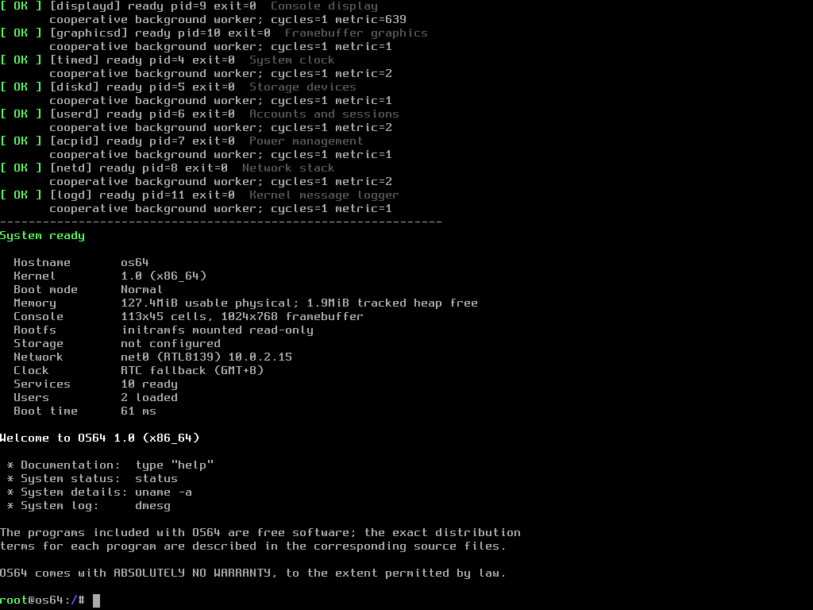

<div align="center">

```text
   ____  _____  __   _  _
  / __ \/ ___/ / /_ | || |
 | |  | \__ \ | '_ \| || |_
 | |__| |___/ /| (_) |__   _|
  \____/|____/  \___/   |_|
```

# OS64 1.0

**A lightweight experimental operating system for x86_64**

Kernel · Initramfs · Unix-style userland · Networking · Native SDK

</div>

---

OS64 is an educational 64-bit x86 operating system. GRUB loads a Multiboot2
bootstrap which verifies x86-64 long-mode support before entering the
freestanding kernel. The kernel provides VGA and serial consoles, PS/2 input,
ATA/FAT32 storage, a read-only USTAR initramfs, VFS dispatch, an ELF64
application ABI, users, protected password hashes, and cooperative services.

## OS64 Running in QEMU



## Source layout

- `boot/` contains GRUB configuration and boot/linker support.
- `kernel/arch/x86_64/` contains architecture bootstrap and interrupts.
- `kernel/drivers/` contains ACPI, disk, display, keyboard, and RTC drivers.
- `kernel/core/`, `kernel/fs/`, `kernel/mm/`, and `kernel/security/` contain
  their respective kernel subsystems.
- `kernel/include/os64/` contains private kernel headers.
- `user/bin/` and `user/sbin/` describe normal and administrative commands.
  Their ELF trampolines are built from `user/lib/builtin.c`.
- `user/games/teteris/` is the optional Teteris application source.
- `rootfs/` is the human-maintained root filesystem template.
- `libc/` is reserved for the freestanding C library.
- `sdk/` contains the public application ABI, linker script, build rules, and
  examples.
- `scripts/` contains image and application-discovery tooling.
- `build/` contains generated artifacts only and may always be deleted.

No object or generated executable is written beside its source. Kernel objects
go to `build/obj/kernel`, user objects to `build/obj/user`, and applications are
installed directly into `build/rootfs`. The initramfs, ISO staging area, and
final images have distinct directories below `build/`.

## Root filesystem and storage

`rootfs/` is copied to `build/rootfs`, populated with compiled applications,
then packed as `build/initrd/initrd.tar`. GRUB loads this archive as a separate
Multiboot2 module alongside `kernel.bin`; it is not embedded recursively in the
kernel. The USTAR encoding is an implementation detail; the VFS exposes it as
the read-only `initramfs` root filesystem. It provides `/bin`, `/sbin`,
`/etc`, `/lib`, and `/usr`. Normal programs are installed in `/bin` or
`/usr/bin`; administrative programs are installed in `/sbin` or `/usr/sbin`.
Teteris is installed as `/usr/bin/teteris`, with game data reserved below
`/usr/share/games`.

At boot, the VFS exposes the USTAR initramfs and mounts `/dev/sda1` at `/home`
and `/dev/sda2` at `/var`. It also mounts generated `procfs` at `/proc`,
device-backed `devfs` at `/dev`, and a bounded volatile `tmpfs` at `/tmp`.
FAT32 is used for the interoperable home partition. The native partition can
be formatted as standard ext2, ext3, or ext4; installation defaults to ext4.
The compact kernel driver uses 4 KiB blocks, standard block and inode bitmaps,
128-byte inodes, directory records, direct blocks, modes, UID/GID, and link
counts. Ext3/ext4 volumes contain the standard internal JBD2 journal inode;
ext4 also advertises the standard extents incompatibility feature while OS64's
own small files remain valid legacy block-mapped inodes. Volumes produced by
OS64 can be inspected and checked with Linux `debugfs`, `blkid`, and `e2fsck`.
`/etc/passwd` holds public account metadata and protected `/etc/shadow`
holds salted PBKDF2-HMAC-SHA256 verifiers. Denied filesystem operations return
an error instead of crashing the kernel.

Run `make smoke-commands` to boot an isolated QEMU disk and invoke every
installed `/bin` and `/sbin` command. The matrix rejects hangs, crashes, and
nonzero exit statuses and automatically fails when a new command lacks a test.

The attached disk is `build/images/os64-disk.img`. `format /dev/sda` creates
FAT32 plus default ext4 data filesystems; pass `ext2`, `ext3`, or `ext4` as the
second argument to select the native format. `install /dev/sda` performs a complete installation:
it formats the partitions, installs the GRUB BIOS boot area, and copies
`KERNEL.BIN` and `INITRD.TAR` to the FAT32 boot volume. The resulting disk boots
without the ISO. Shutdown and reboot synchronize and unmount writable
filesystems. `make check-fat` runs a read-only `fsck.fat` validation of the
FAT32 partition.

## Build and run

Required host tools include GCC/binutils with x86-64 support, NASM, GRUB image
tools, `xorriso`, QEMU, DOS/FAT utilities, and standard POSIX shell tools.

```sh
make                 # build ISO and persistent disk image
make check           # validate the Multiboot2 kernel
make check-fat       # validate the FAT32 home partition
make check-ext       # create and host-check ext2, ext3, and ext4 variants
make run             # serial terminal, no graphical display
make run-console     # QEMU nographic console
make run-gui         # VGA/PS2 graphical VM
make run-pcnet       # test the AMD PCnet adapter used by VirtualBox
make run-installed   # boot an installed disk without the LiveCD
make debug           # QEMU stopped with a GDB server on port 1234
make clean           # safely delete the complete generated build/ tree
```

Final images are `build/images/os64.iso` and
`build/images/os64-disk.img`. GRUB provides normal, CLI, resolution, debug,
recovery, and rescue entries. Use `Ctrl-a x` to exit a nographic QEMU session.

GRUB passes an explicit `bootmode=` kernel argument. Supported values are
`bootmode=normal`, `bootmode=cli`, `bootmode=debug`, and `bootmode=recovery`. CLI
mode forces text output and refuses full-screen TUI applications. The older
`mode=` spelling remains accepted for compatibility. Debug mode enables
diagnostic command-line output; recovery mode skips writable storage, account,
and network startup. Additional independent arguments include
`console=serial`, `loglevel=debug`, and `single`.

## Applications

Generic command names are maintained in `user/commands.conf`. `make scan-apps`
searches application directories containing a Makefile and prints the
discovered projects; the user build installs each output into its canonical
root filesystem destination without a duplicate binary cache.

The public SDK is in `sdk/`. An application is a freestanding ELF64 executable
using the OS64 ABI rather than Linux system calls. `sdk/examples/hello` shows
the minimum layout and writes all generated files under `build/obj/sdk`.

## Runtime notes

The shell accepts command names case-insensitively, updates its prompt after
`cd`, and resolves executables in `/bin`, `/sbin`, `/usr/bin`, and persistent
`/var/apps`. The administrative `install [/dev/sda]` command installs the
storage layout, GRUB bootloader, kernel, and initramfs, while
`install-apps PROGRAM [NAME]` installs an ELF
application persistently under `/var/apps`. `ls` uses VFS directory iteration and only reports immediate
children of the requested directory. MOTD files understand `(bold)`,
`(/bold)`, `(green)`, `(yellow)`, `(white)`, and `(reset)` display tags.

PID 1 starts services through readiness gates. `fsd` and `memoryd` establish
the base services; `displayd` verifies the console and `graphicsd` manages the
VGA text framebuffer compositor. Dependent time, disk, account, ACPI, and
network services start only after their prerequisites report ready. Service
status includes lifecycle state, exit code, poll cycles, and a live subsystem
metric. ELF return values become shell exit statuses, missing
commands return 127, invalid executables return 126, and `status` prints the
most recent result.

The boot console uses a compact release banner, standardized colored
`[ OK ]`/`[WARN]`/`[FAIL]` records, a service/storage summary, and an
overridable `/etc/motd`. The shell has a colored user/path prompt, grouped
help, nearest-command suggestions, in-memory `history`, Up/Down recall, and
Left/Right insertion and deletion editing on PS/2 and ANSI serial consoles.
`free` reports Multiboot physical memory and live heap allocator counters;
`free -h` formats them with binary units. Destructive installation requires an
explicit `YES` confirmation.

## Experimental networking

OS64 includes polling PCI drivers for Realtek RTL8139 and AMD PCnet-PCI
II/PCnet-FAST III (Am79C970A/Am79C973), selected automatically at boot. Its
minimal network stack supports Ethernet II, ARP, routed IPv4, ICMP, UDP, DNS
A-record resolution, TCP clients, and plain HTTP. `netd`
owns the interface and participates in init readiness ordering. `/dev/net0`
represents the selected device; `ifconfig` displays its driver, MAC address,
fixed IPv4 configuration, and packet counters, and `ping 10.0.2.2` tests the
QEMU userspace-network gateway.

`nslookup example.com` (also available as `host example.com`) queries the NAT
resolver at `10.0.2.3`. `ping` accepts either an IPv4 address or a DNS hostname.
`route` and `ip route` show the connected subnet and default route. The IPv4
router ARPs directly for on-link destinations and sends off-link packets to the
default gateway's Ethernet address without replacing their remote IPv4
destination. ICMP Destination Unreachable errors report their type and code.

`curl http://example.com/` provides a minimal HTTP/1.0 GET client. It resolves
the host, opens a TCP connection, prints the response, and asks the server to
close the connection. HTTPS URLs are rejected because OS64 does not yet
implement TLS or certificate validation.

The normal QEMU Makefile targets attach RTL8139; `make run-pcnet` attaches
PCnet for compatibility testing. In VirtualBox, select
`PCnet-FAST III (Am79C973)` as the adapter type. Both use address
`10.0.2.15/24` and gateway `10.0.2.2`. Networking is deliberately disabled in
recovery mode. This is an experimental educational stack: DHCP, TLS,
fragmentation, IPv6, interrupts, TCP server sockets, and production-grade
congestion control/retransmission are not implemented. A successful gateway
ping or DNS lookup is not treated as proof of general Internet connectivity.

OS64 remains a small hobby system: its ABI, native filesystem, permissions, and
service model are intentionally educational rather than POSIX-complete.
